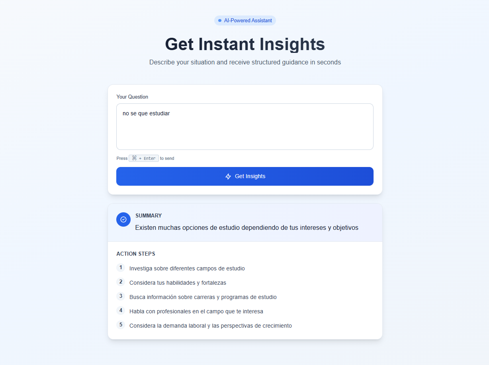

  
  </a>
  &nbsp;&nbsp;&nbsp;&nbsp;
  

# Laravel + Next.js AI Starter
Arquitectura base moderna para proyectos con IA usando **Laravel (API)** y **Next.js (Frontend)**

## Descripción
Monorepo base para construir aplicaciones modernas con separación clara de responsabilidades,
preparado para integrar servicios de Inteligencia Artificial.

Este proyecto está pensado como:
- Hackathones y prototipos rápidos
- Entrenamiento profesional
- Base para proyectos reales en entorno empresarial

Arquitectura
------------

El proyecto está dividido en dos aplicaciones independientes:

laravel-next-ai-starter/
|
|-- backend/    Laravel 11 - API REST + lógica de negocio + IA
|
|-- frontend/   Next.js - UI / UX
|
|-- README.md
|
|-- .gitignore

- Frontend (Next.js): se encarga únicamente de la experiencia de usuario
- Backend (Laravel): expone una API REST y centraliza la lógica de negocio y la IA

  

Stack tecnológico
-----------------

Backend:
- Laravel 11
- API REST
- Services pattern
- Preparado para integración con IA (Gemini / OpenAI)

Frontend:
- Next.js (App Router)
- TypeScript
- Tailwind CSS

Flujo de comunicación
---------------------

1. El usuario interactúa con la UI en Next.js
2. Next.js realiza una petición HTTP a la API de Laravel
3. Laravel recibe la solicitud
4. Un Service procesa la lógica / IA
5. Laravel devuelve un JSON
6. Next.js renderiza la respuesta

Instalación y ejecución
-----------------------

Backend (Laravel):

cd backend
composer install
php artisan serve

Servidor disponible en:
http://127.0.0.1:8000

Frontend (Next.js):

cd frontend
npm install
npm run dev

Aplicación disponible en:
http://localhost:3000

Variables de entorno
--------------------

Frontend (frontend/.env.local):

NEXT_PUBLIC_API_URL=http://127.0.0.1:8000

Backend (Laravel .env):

FRONTEND_URL=http://localhost:3000

Esta variable se utiliza para permitir la comunicación entre el frontend (Next.js)
y el backend (Laravel) mediante CORS.

Objetivo del proyecto
---------------------

Este repositorio no representa una aplicación final, sino un starter profesional que demuestra:

- separación clara de responsabilidades
- arquitectura frontend / backend desacoplada
- uso moderno de Laravel y Next.js
- base sólida para proyectos con integración de IA

Notas
-----

- La integración de IA se maneja exclusivamente en el backend
- El frontend nunca accede directamente a la lógica de negocio ni a la IA
- El proyecto puede extenderse fácilmente con autenticación, base de datos o despliegue
- Ideal como base para hackathones y proyectos profesionales

Licencia
--------

MIT
